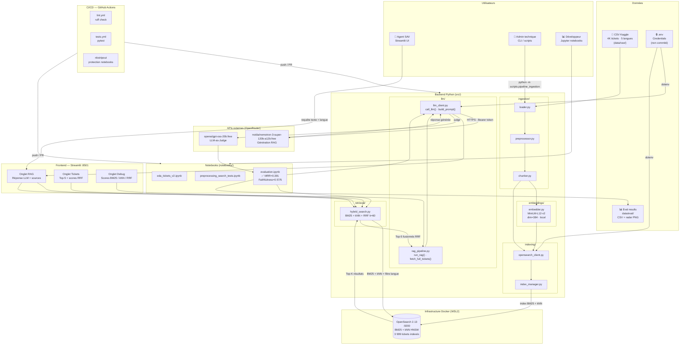

# Architecture Système — RAG-time LogiStore

**Projet** : RAG-time — LogiStore
**Version** : 1.0
**Date** : Mai 2026

---

## 1. Vue d'ensemble du système

---

## 2. Flux réseau

┌─────────────────────────────────────────────────────────────────────┐
│ Machine locale Windows (WSL2) │
│ │
│ ┌──────────────┐ HTTP :8501 ┌─────────────────────────────┐ │
│ │ Browser │ ◄──────────────► │ Streamlit app.py │ │
│ │ Agent SAV │ │ src/frontend/ │ │
│ └──────────────┘ └──────────────┬──────────────┘ │
│ │ │
│ Python src/ │
│ retrieval/ · llm/ │
│ │ │
│ ┌────────────────────┼──────────────┐ │
│ │ │ │ │
│ HTTPS :9200│ HTTPS │OpenRouter │ │
│ ▼ ▼ │ │
│ ┌──────────────┐ ┌──────────────────────┐ │ │
│ │ OpenSearch │ │ api.openrouter.ai │ │ │
│ │ 2.13 Docker │ │ Nemotron 120B │ │ │
│ │ (WSL2) │ │ GPT-OSS-20B │ │ │
│ └──────────────┘ └──────────────────────┘ │ │
│ │ │
└───────────────────────────────────────────────────────────────────┘ │
│
GitHub Actions (lint + tests) ◄──────────────────────────────┘
github.com/Skand13/rag-project

---

## 3. Composants — Fiche technique

| Composant | Technologie | Port | Rôle | Statut |
|---|---|---|---|---|
| **Frontend** | Streamlit | 8501 | Interface agent SAV (3 onglets) | ✅ |
| **Retrieval** | hybrid_search.py | — | BM25 + kNN + RRF k=60 | ✅ |
| **LLM client** | llm_client.py + OpenRouter | 443 (HTTPS) | Génération RAG multilingue | ✅ |
| **RAG pipeline** | rag_pipeline.py | — | Orchestration retrieval → LLM | ✅ |
| **Ingestion** | loader + preprocessor + chunker | — | CSV → chunks + metadata | ✅ |
| **Embedder** | MiniLM-L12-v2 (local) | — | Vecteurs dim=384 | ✅ |
| **Index** | OpenSearch 2.13 (Docker) | 9200 | BM25 + kNN HNSW, 3 999 docs | ✅ |
| **LLM génération** | Nemotron 120B (OpenRouter) | 443 | Réponses RAG multilingues | ✅ |
| **LLM évaluation** | GPT-OSS-20B (OpenRouter) | 443 | LLM-as-Judge JSON strict | ✅ |
| **CI lint** | GitHub Actions + ruff | — | Vérification style à chaque push | ✅ |
| **CI tests** | GitHub Actions + pytest | — | Tests unitaires à chaque push | ✅ |
| **Notebooks** | Jupyter :8889 | 8889 | EDA, preprocessing, évaluation | ✅ |

---

## 4. Sécurité et credentials
┌─────────────────────────────────────────────────────────┐
│ Gestion des secrets │
│ │
│ .env (non commité, dans .gitignore) │
│ ├── OPENROUTER_API_KEY=... │
│ ├── OPENSEARCH_PASSWORD=R@gTime2026#Store │
│ └── EMBEDDING_DIM=384 │
│ │
│ .env.example (commité — template sans valeurs) │
│ │
│ nbstripout (hook git pre-commit) │
│ └── Supprime les outputs de notebooks avant commit │
│ → empêche la fuite de clés API dans les outputs │
└─────────────────────────────────────────────────────────┘

**Incident résolu** : clé OpenRouter committée dans un notebook → réécriture historique git (`git filter-repo`), nouvelle clé générée, nbstripout installé.

---

## 5. Intégration SI — Trajectoire

---

## 6. Qualité et tests

| Couche | Outil | Couverture | Statut |
|---|---|---|---|
| Style / lint | ruff (GitHub Actions) | Tout le code src/ | ✅ Au vert |
| Tests unitaires | pytest | test_pipeline.py | ✅ Au vert |
| Notebooks | nbstripout | Tous les .ipynb | ✅ Actif |
| Évaluation retrieval | evaluation.ipynb | 50 requêtes · 5 langues | ✅ MRR=0.391 |
| Évaluation RAG | LLM-as-Judge (GPT-OSS-20B) | 50 requêtes · 5 langues | ✅ Context Precision=3.06/5 |