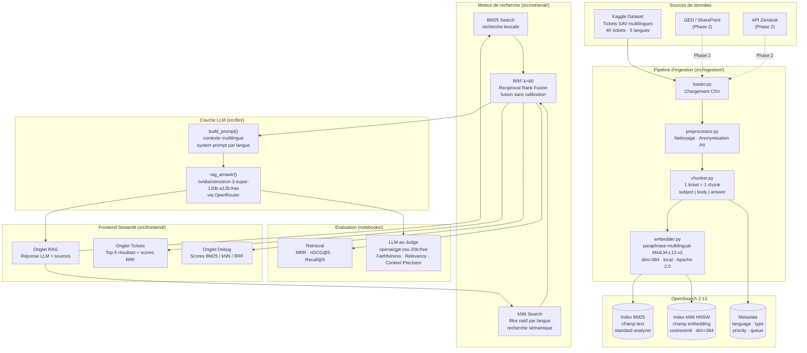

# Architecture — Système RAG LogiStore

**Version** : 1.1 (MVP réalisé)
**Date** : Mai 2026

---

## Table des matières

1. [Vue d'ensemble](#1-vue-densemble)
2. [Diagramme d'architecture](#2-diagramme-darchitecture)
3. [Pipeline d'ingestion](#3-pipeline-dingestion)
4. [Moteur de recherche hybride](#4-moteur-de-recherche-hybride)
5. [Couche LLM](#5-couche-llm)
6. [Frontend Streamlit](#6-frontend-streamlit)
7. [Choix technologiques](#7-choix-technologiques)
8. [Infrastructure et CI/CD](#8-infrastructure-et-cicd)
9. [Trajectoire d'extension](#9-trajectoire-dextension)

---

## 1. Vue d'ensemble

Le système RAG LogiStore est composé de 4 couches principales :
[Sources CSV] → [Pipeline d'ingestion] → [OpenSearch 2.13]
│
[Retrieval hybride BM25 + kNN]
│
[LLM Nemotron 120B via OpenRouter]
│
[Frontend Streamlit]


**Principe** : une requête agent SAV déclenche une recherche hybride (BM25 + kNN HNSW, fusionnés par RRF k=60) sur 3 999 tickets indexés. Les 5 tickets les plus pertinents sont transmis à Nemotron 120B qui génère une réponse contextualisée dans la langue de la requête.

---

## 2. Diagramme d'architecture



---

## 3. Pipeline d'ingestion

### 3.1 Flux détaillé
[CSV Kaggle — 4 000 tickets, 17 colonnes]
│
▼
[loader.py]
- Lecture CSV avec pandas
- Typage des colonnes
- Suppression des doublons
│
▼
[preprocessor.py]
- Normalisation langue → lowercase (en/fr/de/es/pt)
- Nettoyage HTML, caractères spéciaux
- Anonymisation PII (emails, téléphones → [EMAIL], [PHONE])
- Construction champ text : "subject | body | answer"
│
▼
[chunker.py]
- Stratégie : 1 ticket = 1 chunk (médiane < 512 tokens)
- Metadata : language, type, priority, queue, tag_1..tag_9
│
▼
[embedder.py]
- Modèle : paraphrase-multilingual-MiniLM-L12-v2 (local)
- Batch encoding → vecteur dim=384 par ticket
│
▼
[opensearch_client.py + index_manager.py]
- Indexation BM25 (champ text)
- Indexation kNN HNSW (champ embedding, cosinesimil)
- 3 999 documents indexés


### 3.2 Mapping OpenSearch

```json
{
  "settings": { "index": { "knn": true } },
  "mappings": {
    "properties": {
      "text":      { "type": "text", "analyzer": "standard" },
      "language":  { "type": "keyword" },
      "type":      { "type": "keyword" },
      "priority":  { "type": "keyword" },
      "embedding": {
        "type": "knn_vector",
        "dimension": 384,
        "method": {
          "name": "hnsw",
          "space_type": "cosinesimil",
          "engine": "lucene"
        }
      }
    }
  }
}
```

### 3.3 Décisions importantes

| Décision | Choix | Raison |
|---|---|---|
| Chunking | 1 ticket = 1 chunk | Unités sémantiques naturelles, médiane < 512 tokens |
| Embedding | Local (pas d'API) | Évite les coûts et la dépendance externe |
| Casing langue | Lowercase forcé | OpenSearch stocke keyword en minuscule |
| Champ text | `subject \| body \| answer` | Concaténation des 3 champs principaux |

---

## 4. Moteur de recherche hybride

### 4.1 Flux d'une requête
[Requête agent SAV]
│
├──────────────────────────────────────────┐
│ │
▼ ▼
[BM25 Search] [kNN Search]
- Recherche lexicale - Encode la requête (dim=384)
- Exact match : numéros, - Filtre natif par langue
codes produits, termes rares - Top-K par similarité cosinus
- Top-K résultats - Top-K résultats
│ │
└──────────────────┬───────────────────────┘
│
▼
[RRF k=60 — Fusion]
score(d) = Σ 1/(k + rank(d))
│
▼
[Top-5 tickets fusionnés]


### 4.2 Décision technique — Filtre kNN natif

> **Problème résolu** : dans OpenSearch 2.13, utiliser `bool/filter` autour d'une requête kNN renvoie 0 résultats pour FR, DE, ES, PT. La solution est d'utiliser le filtre natif **à l'intérieur** du bloc kNN.

```python
# ❌ Ne pas faire (bool/filter wrapper — échoue pour FR/DE)
{
    "bool": {
        "filter": [{"term": {"language": "fr"}}],
        "must": [{"knn": {...}}]
    }
}

# ✅ À faire (filtre natif kNN — fonctionne pour toutes les langues)
{
    "knn": {
        "embedding": {
            "vector": query_vector,
            "k": top_k,
            "filter": {"term": {"language": "fr"}}
        }
    }
}
```

### 4.3 Formule RRF

$$\text{RRF\_score}(d) = \frac{1}{k + \text{rank}_{BM25}(d)} + \frac{1}{k + \text{rank}_{kNN}(d)}$$

Avec `k = 60` (valeur empirique, Cormack et al. 2009).

---

## 5. Couche LLM

### 5.1 Composants

| Fichier | Rôle |
|---|---|
| `llm_client.py` | `call_llm()`, `build_prompt()`, `rag_answer()`, prompts système par langue |
| `rag_pipeline.py` | `run_rag()`, `to_rag_tickets()`, `fetch_full_tickets()` |

### 5.2 Prompts système multilingues

```python
SYSTEM_PROMPTS = {
    "en": "You are a helpful customer support assistant for LogiStore...",
    "fr": "Tu es un assistant support client pour LogiStore...",
    "de": "Du bist ein hilfreicher Kundensupport-Assistent für LogiStore...",
    "es": "Eres un asistente de soporte al cliente de LogiStore...",
    "pt": "És um assistente de suporte ao cliente da LogiStore...",
}
```

### 5.3 Modèles utilisés

| Rôle | Modèle | Raison |
|---|---|---|
| **Génération RAG** | `nvidia/nemotron-3-super-120b-a12b:free` | Modèle puissant, gratuit sur OpenRouter |
| **LLM-as-Judge** | `openai/gpt-oss-20b:free` | Suit strictement les instructions JSON — Nemotron est un modèle "thinking" qui ignore les formats imposés |

### 5.4 Résultats LLM-as-Judge (50 requêtes)

| Métrique | Score /5 | Interprétation |
|---|---|---|
| **Faithfulness** | 0.57 | Nemotron extrapole au-delà du contexte — axe prioritaire |
| **Answer Relevancy** | 2.37 | Réponses partiellement pertinentes |
| **Context Precision** | 3.06 | ✅ Le retrieval hybride ramène du contexte utile |

---

## 6. Frontend Streamlit

### 6.1 Structure de l'interface
app.py
├── Onglet 1 — Réponse RAG
│ ├── Champ de recherche texte libre
│ ├── Sélecteur de langue (en/fr/de/es/pt)
│ ├── Sélecteur de modèle LLM
│ ├── Réponse générée par Nemotron
│ └── Tickets sources utilisés (avec scores)
│
├── Onglet 2 — Tickets similaires
│ ├── Top-5 résultats
│ ├── Score RRF par résultat
│ └── Détail : sujet, corps, résolution, metadata
│
└── Onglet 3 — Debug
├── Scores BM25 bruts
├── Scores kNN bruts
└── Score RRF final


### 6.2 Lancement

```bash
# Depuis rag-project/
streamlit run src/frontend/app.py
```

---

## 7. Choix technologiques

### 7.1 Moteur d'indexation — OpenSearch 2.13

**Retenu** pour le MVP. Justifications :

| Critère | OpenSearch 2.13 | Qdrant 1.9 |
|---|---|---|
| BM25 natif | ✅ | ⚠️ Via sparse vectors |
| k-NN vectoriel | ✅ HNSW lucene | ✅ HNSW natif |
| Recherche hybride | ✅ BM25 + kNN | ✅ Dense + Sparse |
| Dashboard monitoring | ✅ OpenSearch Dashboards | ❌ |
| RAM (1 nœud) | 512 MB min | 256 MB min |
| Licence | Apache 2.0 | Apache 2.0 |
| **Verdict MVP** | ✅ **Retenu** | Trajectoire Phase 3 |

### 7.2 Modèle d'embedding — paraphrase-multilingual-MiniLM-L12-v2

**Retenu** pour le MVP (local, gratuit, Apache 2.0).

| Modèle | MTEB | Dim | Langues | Coût | Statut |
|---|---|---|---|---|---|
| **MiniLM-L12-v2** (retenu) | ~57 | 384 | 50+ | Gratuit local | ✅ MVP |
| BAAI/bge-m3 | 63.0 | 1024 | 100+ | Gratuit local | Phase 2 |
| Qwen3-Embedding-8B | 70.58 | 7168 | Multi | Gratuit local | Phase 3 |
| text-embedding-3-small | 62.3 | 1536 | Multi | $0.02/1M | Alternative |

### 7.3 LLM — OpenRouter

| Modèle | Usage | Statut |
|---|---|---|
| `nvidia/nemotron-3-super-120b-a12b:free` | Génération RAG | ✅ MVP |
| `openai/gpt-oss-20b:free` | LLM-as-Judge | ✅ MVP |
| `google/gemma-4-31b-it:free` | Alternative évaluation | ⚠️ Quota 429 |
| `deepseek/deepseek-v4-flash:free` | Génération requêtes test | ⚠️ Modèle "thinking" — ne pas utiliser pour judge |

---

## 8. Infrastructure et CI/CD

### 8.1 Docker Compose

```yaml
# docker/docker-compose.yml
services:
  opensearch:
    image: opensearchproject/opensearch:2.13.0
    environment:
      - discovery.type=single-node
      - OPENSEARCH_INITIAL_ADMIN_PASSWORD=R@gTime2026#Store
      - "OPENSEARCH_JAVA_OPTS=-Xms512m -Xmx512m"
    ports:
      - "9200:9200"
    volumes:
      - opensearch-data:/usr/share/opensearch/data
```

```bash
# Lancement
docker compose -f docker/docker-compose.yml up -d

# Vérification
curl -k -u admin:R@gTime2026#Store https://localhost:9200/_cluster/health
```

### 8.2 Variables d'environnement

```env
# .env (ne pas commiter — voir .env.example)
OPENSEARCH_HOST=localhost
OPENSEARCH_PORT=9200
OPENSEARCH_USER=admin
OPENSEARCH_PASSWORD=R@gTime2026#Store
OPENROUTER_API_KEY=<votre_clé>
OPENROUTER_MODEL=nvidia/nemotron-3-super-120b-a12b:free
EMBEDDING_BACKEND=local
LOCAL_EMBEDDING_MODEL=paraphrase-multilingual-MiniLM-L12-v2
EMBEDDING_DIM=384
```

### 8.3 GitHub Actions

| Workflow | Déclencheur | Étapes | Statut |
|---|---|---|---|
| `lint.yml` | Push / PR | `ruff check` (ignore E501, E402) | ✅ Au vert |
| `tests.yml` | Push / PR | `pytest` (loguru, opensearch-py, etc.) | ✅ Au vert |

### 8.4 Sécurité des credentials

> **Incident résolu** : une clé OpenRouter a été commitée accidentellement dans un notebook.

Actions prises :
- `nbstripout` installé — supprime automatiquement les outputs de notebooks avant commit
- Réécriture de l'historique git (`git filter-repo`) pour supprimer la clé
- Nouvelle clé générée sur OpenRouter
- `.gitignore` mis à jour pour exclure `.env`

---

## 9. Trajectoire d'extension

### 9.1 Améliorations retrieval

| Amélioration | Impact attendu | Complexité |
|---|---|---|
| Cross-encoder re-ranking | +15-20% MRR | Moyenne |
| Query expansion (HyDE) | +10% Context Precision | Moyenne |
| SPLADE sparse vectors | Meilleur ES/DE/PT | Élevée |
| BGE-M3 (dim=1024) | +5-10% global | Faible (swap modèle) |

### 9.2 Améliorations LLM

| Amélioration | Impact attendu | Complexité |
|---|---|---|
| Instruction "réponds UNIQUEMENT depuis le contexte" | +Faithfulness | Faible |
| Réduire max_tokens (512→256) | Moins d'extrapolation | Faible |
| Fine-tuning sur tickets LogiStore | +Relevancy | Très élevée |

### 9.3 Intégrations SI

Phase 2 (mois 1-2)
├── Connecteur API Zendesk → tickets en temps réel
└── Indexation GED SharePoint → procédures SAV

Phase 3 (mois 3-4)
├── CRM Salesforce → contexte client enrichi
└── PIM Akeneo → fiches produits dans le RAG

Phase 4 (mois 5-6)
├── Plugin Zendesk natif
└── Chatbot multi-tours avec mémoire de session

Phase 5 (mois 7+)
├── Déploiement on-premise / cloud privé
├── SSO Active Directory
└── Monitoring Prometheus + Grafana + Evidently AI
