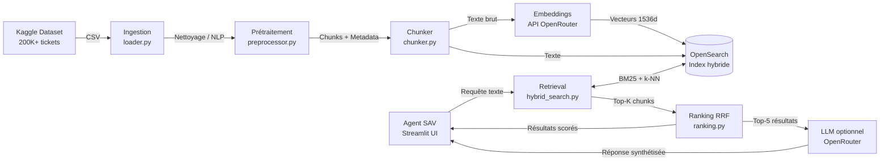

# Document de Cadrage — Projet RAG-time

**Entreprise** : LogiStore
**Équipe projet** : 3 développeurs-consultants  
**Durée du sprint MVP** : 10 jours  
**Version** : 1.0  
**Date** : Avril 2026  
**Statut** : En cours de validation

---

## Table des matières

1. [Contexte et enjeux](#1-contexte-et-enjeux)
2. [Présentation de LogiStore](#2-présentation-de-logistore)
3. [Problématique métier](#3-problématique-métier)
4. [Objectifs du projet](#4-objectifs-du-projet)
5. [Cartographie du SI existant](#5-cartographie-du-si-existant)
6. [Sources de données](#6-sources-de-données)
7. [Cas d'usage](#7-cas-dusage)
8. [Périmètre du MVP](#8-périmètre-du-mvp)
9. [Architecture cible simplifiée](#9-architecture-cible-simplifiée)
10. [Trajectoire d'extension](#10-trajectoire-dextension)
11. [Organisation du projet](#11-organisation-du-projet)
12. [Contraintes et hypothèses](#12-contraintes-et-hypothèses)
13. [Critères de succès](#13-critères-de-succès)
14. [Glossaire](#14-glossaire)

---

## 1. Contexte et enjeux

Le secteur de la logistique et de la distribution fait face à une pression croissante sur la qualité du service après-vente. Les volumes de tickets de support explosent avec la croissance du e-commerce, tandis que les agents SAV passent une part importante de leur temps à rechercher manuellement des précédents dans l'historique des incidents.

L'intelligence artificielle, et plus particulièrement les systèmes **RAG (Retrieval-Augmented Generation)**, offre une réponse concrète à ce problème : exploiter automatiquement la base documentaire existante (tickets résolus, procédures, FAQ) pour assister les agents en temps réel.

> Des acteurs comme Fnac Darty ont démontré que les outils d'IA permettent d'automatiser jusqu'à **80 % des réponses aux questions les plus fréquentes** ([Valtech — Tech for Retail 2024](https://www.valtech.com/fr-fr/analyses/tech-for-retail-2024-3-trends-defining-retail/)), tout en améliorant la satisfaction client et en réduisant la charge sur les équipes support.

Ce projet vise à concevoir et implémenter un **MVP RAG** centré sur les tickets SAV de LogiStore, avec une architecture évolutive vers une intégration complète dans le SI.

---

## 2. Présentation de LogiStore

| Attribut | Valeur |
|---|---|
| **Secteur** | Logistique / Distribution e-commerce |
| **Taille** | ETI (~500 employés, dont ~30 agents SAV) |
| **Canaux** | Vente en ligne (B2C et B2B), partenaires distributeurs |
| **Géographie** | France métropolitaine principalement |
| **Volume tickets SAV** | 200 000+ tickets actifs (base Kaggle comme proxy) |
| **Croissance tickets** | +15% / an estimé |
| **TTR actuel (Time To Resolution)** | ~4h en moyenne |
| **Objectif TTR cible** | < 2h grâce à l'assistance IA |

**Catégories de tickets SAV principales** :

| Catégorie | Part estimée | Exemples |
|---|---|---|
| Problèmes de livraison | ~35% | Colis perdu, retard, mauvaise adresse |
| Défauts produit | ~25% | Article défectueux, non-conforme |
| Retours et remboursements | ~20% | Procédure retour, délai remboursement |
| Problèmes de facturation | ~12% | Double facturation, bon de réduction |
| Questions d'information | ~8% | Disponibilité, délais, caractéristiques |

---

## 3. Problématique métier

### 3.1 Situation actuelle (AS-IS)

Actuellement, le processus de traitement d'un ticket SAV entrant suit ce flux :

```
[Client soumet un ticket via Zendesk]
              │
              ▼
[Agent SAV reçoit le ticket]
              │
              ▼
[Recherche manuelle dans l'historique Zendesk]  ← Temps perdu (30-45 min/ticket)
              │
              ▼
[Consultation des procédures SharePoint]        ← Dispersion de l'information
              │
              ▼
[Rédaction de la réponse de zéro]              ← Réponses non standardisées
              │
              ▼
[Résolution et clôture du ticket]
```

**Problèmes identifiés** :

| Problème | Impact |
|---|---|
| Recherche manuelle dans 200K+ tickets | 30 à 45 min perdues par ticket complexe |
| Information dispersée (Zendesk, SharePoint, ERP, PIM) | Risque d'oubli de procédures |
| Réponses non standardisées selon l'agent | Qualité inégale, insatisfaction client |
| Pas de capitalisation sur les résolutions passées | Réinvention de la roue à chaque ticket similaire |
| Montée en compétence lente des nouveaux agents | 3-6 mois avant autonomie complète |

### 3.2 Situation cible (TO-BE)

Avec le système RAG, le flux devient :

```
[Client soumet un ticket via Zendesk]
              │
              ▼
[Agent SAV reçoit le ticket]
              │
              ▼
[Saisie de la description dans l'interface RAG]
              │
              ▼
[Le système récupère automatiquement les 5 tickets les plus similaires]
              │
              ▼
[Affichage des résolutions passées avec score de pertinence]
              │
              ▼
[Option : génération d'une réponse suggérée par le LLM]  (optionnel MVP)
              │
              ▼
[L'agent valide / adapte / envoie la réponse]
```

**Gains attendus** :

| Indicateur | Avant | Cible |
|---|---|---|
| Temps de recherche par ticket | 30-45 min | < 5 min |
| TTR moyen | ~4h | < 2h |
| Standardisation des réponses | Faible | Élevée |
| Montée en compétence nouveaux agents | 3-6 mois | 1-2 mois |
| Satisfaction client (CSAT) | Mesure de base | +10 pts |

---

## 4. Objectifs du projet

### 4.1 Objectif principal

Concevoir et implémenter un **système RAG MVP** permettant aux agents SAV de LogiStore de retrouver instantanément les tickets similaires et les résolutions associées, via une interface de recherche à **ranking explicable**.

### 4.2 Objectifs spécifiques

| # | Objectif | Indicateur de succès | Priorité |
|---|---|---|---|
| O1 | Moteur de recherche hybride (BM25 + vectoriel) opérationnel | Precision@5 > 0.70 sur jeu de test | MUST |
| O2 | Interface Streamlit fonctionnelle avec filtres | Demo live sur jeu de données réel | MUST |
| O3 | Ranking explicable (score RRF affiché) | Chaque résultat affiche son score et ses sources | MUST |
| O4 | Pipeline d'ingestion reproductible | Ré-exécutable en < 30 min depuis zéro | MUST |
| O5 | Couche LLM de synthèse/reformulation | Réponse suggérée cohérente avec le contexte | SHOULD |
| O6 | Évaluation automatisée du système | Script RAGAS exécutable avec rapport | SHOULD |
| O7 | Authentification RBAC légère | Accès différencié agent / admin | COULD |
| O8 | Déploiement containerisé (Docker) | `docker-compose up` suffit à lancer le projet | MUST |

### 4.3 Hors périmètre MVP (explicitly out-of-scope)

- Intégration avec l'API Zendesk réelle (proxy Kaggle uniquement)
- Connexion au CRM Salesforce ou à l'ERP SAP
- Déploiement en production / cloud
- Apprentissage continu ou fine-tuning de modèles
- Application mobile
- Multi-langue (MVP en anglais, données Kaggle)

---

## 5. Cartographie du SI existant

### 5.1 Vue d'ensemble du SI LogiStore

```
┌─────────────────────────────────────────────────────────────────────────┐
│                          SI LOGISORE                                     │
│                                                                          │
│  ┌────────────┐  ┌────────────┐  ┌────────────┐  ┌──────────────────┐  │
│  │    ERP     │  │    CRM     │  │    PIM     │  │    Ticketing     │  │
│  │  SAP B1    │  │ Salesforce │  │   Akeneo   │  │    Zendesk       │  │
│  │            │  │            │  │            │  │                  │  │
│  │ Commandes  │  │  Clients   │  │  Produits  │  │  Tickets SAV     │  │
│  │ Stock      │  │  Historique│  │  Catalogue │  │  Résolutions     │  │
│  │ Facturation│  │  Contacts  │  │  Fiches    │  │  Tags / Statuts  │  │
│  └─────┬──────┘  └─────┬──────┘  └─────┬──────┘  └────────┬─────────┘  │
│        │               │               │                   │            │
│        └───────────────┴───────────────┴───────────────────┘            │
│                                     │                                    │
│                            ┌────────▼────────┐                          │
│                            │   GED / Datalake │                         │
│                            │   SharePoint     │                         │
│                            │                  │                         │
│                            │  Procédures SAV  │                         │
│                            │  FAQ internes    │                         │
│                            │  Politiques      │                         │
│                            └────────┬─────────┘                         │
│                                     │                                    │
│                            ┌────────▼─────────┐                         │
│                            │   RAG Engine     │  ◄── NOUVEAU (MVP)      │
│                            │                  │                         │
│                            │  - Ingestion     │                         │
│                            │  - Indexation    │                         │
│                            │  - Retrieval     │                         │
│                            │  - Ranking       │                         │
│                            │  - LLM (optionnel│                         │
│                            └────────┬─────────┘                         │
│                                     │                                    │
│                            ┌────────▼─────────┐                         │
│                            │  Streamlit UI    │  ◄── NOUVEAU (MVP)      │
│                            │  (Agents SAV)    │                         │
│                            └──────────────────┘                         │
└─────────────────────────────────────────────────────────────────────────┘
```

### 5.2 Fiche des composants SI

| Composant | Outil | Rôle dans le SI | Données exposées au RAG | Intégration MVP |
|---|---|---|---|---|
| **ERP** | SAP Business One | Gestion commandes, stock, facturation, supply chain | Numéros de commande, références produit, statuts livraison |  Non (hors périmètre) |
| **CRM** | Salesforce | Gestion relation client, historique contacts, opportunités | Profils clients (anonymisés), historique interactions, segments |  Non (hors périmètre) |
| **PIM** | Akeneo | Catalogue produits, fiches techniques, médias | Descriptions produits, catégories, caractéristiques techniques |  Non (hors périmètre) |
| **Ticketing** | Zendesk | Tickets SAV, résolutions, tags, statuts, priorités | Corps des tickets, catégories, tags, résolutions (**source principale**) |  Proxy Kaggle |
| **GED** | SharePoint | Documentation interne, procédures, FAQ | Procédures SAV, politiques retour, FAQ agents |  Trajectoire Phase 2 |
| **RAG Engine** | OpenSearch + Python | Indexation hybride, retrieval, ranking | — |  MVP |
| **Frontend** | Streamlit | Interface agents SAV | — |  MVP |

### 5.3 Flux de données dans le SI (MVP)



---

## 6. Sources de données

### 6.1 Dataset principal — Kaggle Customer Support Tickets

| Attribut | Valeur |
|---|---|
| **Nom** | Customer Support Tickets Dataset |
| **Source** | [Kaggle](https://www.kaggle.com/datasets/suraj520/customer-support-ticket-dataset) |
| **Volume** | 200 000+ enregistrements |
| **Format** | CSV |
| **Langue** | Anglais |
| **Licence** | CC BY 4.0 |

**Champs disponibles** :

| Champ | Description | Utilisation dans le RAG |
|---|---|---|
| `ticket_id` | Identifiant unique du ticket | Clé primaire, metadata |
| `customer_name` | Nom du client | Anonymisation RGPD → suppression |
| `customer_email` | Email du client | Anonymisation RGPD → suppression |
| `product_purchased` | Produit concerné | Metadata de filtrage |
| `date_of_purchase` | Date d'achat | Metadata contextuelle |
| `ticket_type` | Type de ticket (Technical, Billing, etc.) | Metadata de filtrage |
| `ticket_subject` | Sujet du ticket | Inclus dans le chunk texte |
| `ticket_description` | Description détaillée du problème | Corps principal du chunk |
| `ticket_status` | Statut (Open, Closed, Pending) | Filtrage sur statut "Closed" |
| `resolution` | Résolution apportée | Inclus dans le chunk texte |
| `ticket_priority` | Priorité (Low, Medium, High, Critical) | Metadata de filtrage |
| `ticket_channel` | Canal (Email, Phone, Chat, Social Media) | Metadata contextuelle |
| `first_response_time` | Délai première réponse | Metadata analytique |
| `time_to_resolution` | Durée de résolution | Metadata analytique |
| `customer_satisfaction_rating` | Note satisfaction (1-5) | Metadata de qualité |

### 6.2 Stratégie de construction des chunks

```python
# Structure d'un chunk indexé
chunk = {
    "ticket_id": "TKT-00123",
    "text": (
        "Type: Technical Support\n"
        "Sujet: Produit défectueux à réception\n\n"
        "Description: Le client signale que le produit GadgetX reçu "
        "présente une fissure sur le boîtier et ne s'allume pas.\n\n"
        "Résolution: Envoi d'un bon de retour + remplacement sous 72h "
        "après réception du produit défectueux."
    ),
    "metadata": {
        "product": "GadgetX Pro",
        "category": "Technical Support",
        "priority": "High",
        "channel": "Email",
        "satisfaction": 4,
        "status": "Closed",
        "ttr_hours": 6.5
    }
}
```

### 6.3 Politique d'anonymisation (RGPD)

Les données Kaggle étant fictives, le risque RGPD direct est nul pour le MVP. Néanmoins, les bonnes pratiques suivantes sont appliquées pour préparer l'intégration future de données réelles :

| Champ sensible | Action | Outil |
|---|---|---|
| `customer_name` | Suppression avant indexation | pandas `drop()` |
| `customer_email` | Suppression avant indexation | pandas `drop()` |
| Numéros de commande | Remplacement par token générique | regex |
| Numéros de téléphone | Masquage (`***-***-XXXX`) | regex |
| Adresses postales | Suppression | regex |

```python
import re

PII_PATTERNS = {
    "email": r"[a-zA-Z0-9._%+-]+@[a-zA-Z0-9.-]+\.[a-zA-Z]{2,}",
    "phone": r"\+?[\d\s\-\(\)]{10,15}",
    "order_id": r"#\d{5,10}"
}

def anonymize_text(text: str) -> str:
    text = re.sub(PII_PATTERNS["email"], "[EMAIL]", text)
    text = re.sub(PII_PATTERNS["phone"], "[PHONE]", text)
    text = re.sub(PII_PATTERNS["order_id"], "[ORDER_ID]", text)
    return text
```

---

## 7. Cas d'usage

### 7.1 Matrice des cas d'usage

| # | Cas d'usage | Acteur | MVP | Extension |
|---|---|---|---|---|
| CU-01 | Rechercher des tickets similaires à un ticket entrant | Agent SAV | ✅ MUST | — |
| CU-02 | Filtrer les résultats par catégorie / produit / priorité | Agent SAV | ✅ MUST | — |
| CU-03 | Afficher les résolutions passées avec score de pertinence | Agent SAV | ✅ MUST | — |
| CU-04 | Générer une réponse suggérée via LLM | Agent SAV | ⚠️ SHOULD | — |
| CU-05 | Consulter le détail d'un ticket source | Agent SAV | ✅ MUST | — |
| CU-06 | Chatbot conversationnel multi-tours | Agent SAV | ❌ | ✅ Phase 2 |
| CU-07 | Analyse de tendances et clustering | Manager SAV | ❌ | ✅ Phase 3 |
| CU-08 | Enrichissement automatique du CRM | Système | ❌ | ✅ Phase 3 |
| CU-09 | Alertes sur pics de tickets similaires | Manager SAV | ❌ | ✅ Phase 3 |
| CU-10 | Intégration directe dans Zendesk (plugin) | Agent SAV | ❌ | ✅ Phase 4 |
| CU-11 | Recherche dans la documentation SAV (SharePoint) | Agent SAV | ❌ | ✅ Phase 2 |
| CU-12 | Administration de l'index (reindex, monitoring) | Admin technique | ⚠️ SHOULD | — |

### 7.2 Description détaillée — Cas d'usage prioritaires MVP

#### CU-01 — Recherche de tickets similaires

**Acteur** : Agent SAV  
**Déclencheur** : Réception d'un nouveau ticket client  
**Précondition** : L'agent dispose du texte du ticket (sujet + description)

**Scénario nominal** :
1. L'agent copie-colle ou saisit la description du ticket dans le champ de recherche Streamlit
2. Le système exécute une recherche hybride (BM25 + vectorielle)
3. Les 5 tickets les plus similaires sont affichés avec :
   - Score de pertinence RRF
   - Extrait de la description
   - Résolution associée
   - Métadonnées (catégorie, produit, priorité, durée de résolution)
4. L'agent consulte les résolutions pour s'en inspirer

**Scénario alternatif** : Aucun résultat pertinent (score < seuil) → message "Aucun ticket similaire trouvé. Créer un nouveau précédent ?"

---

#### CU-04 — Génération de réponse suggérée (optionnel MVP)

**Acteur** : Agent SAV  
**Déclencheur** : Clic sur "Générer une réponse" après consultation des tickets similaires  
**Précondition** : Au moins 1 ticket similaire récupéré avec score > 0.5

**Scénario nominal** :
1. Le système prend les 3 tickets les mieux classés comme contexte
2. Envoie un prompt au LLM (via OpenRouter) : contexte + tickets sources + requête
3. Le LLM génère une réponse structurée et contextualisée
4. La réponse est affichée avec :
   - Texte de réponse suggérée
   - Sources citées (tickets utilisés)
   - Avertissement : "Réponse générée par IA — À valider avant envoi"

---

### 7.3 User Stories (format Agile)

```
US-01 : En tant qu'agent SAV, je veux pouvoir rechercher des tickets similaires
        en saisissant une description, afin de trouver rapidement les résolutions passées.

US-02 : En tant qu'agent SAV, je veux filtrer les résultats par catégorie de ticket
        (Technical / Billing / Shipping), afin de cibler les précédents pertinents.

US-03 : En tant qu'agent SAV, je veux voir le score de pertinence de chaque résultat,
        afin d'évaluer la fiabilité de la suggestion.

US-04 : En tant qu'agent SAV, je veux obtenir une réponse suggérée par l'IA,
        afin d'accélérer la rédaction de ma réponse au client.

US-05 : En tant qu'administrateur, je veux pouvoir relancer l'indexation des tickets,
        afin de maintenir l'index à jour.
```

---

## 8. Périmètre du MVP

### 8.1 Ce qui est dans le MVP

```
✅ INCLUS DANS LE MVP
├── Pipeline d'ingestion depuis le CSV Kaggle
│   ├── Chargement et nettoyage des données
│   ├── Anonymisation PII
│   ├── Chunking par ticket (sujet + description + résolution)
│   └── Génération des embeddings via OpenRouter
├── Indexation hybride dans OpenSearch
│   ├── Index BM25 (full-text)
│   ├── Index vectoriel k-NN (cosine similarity)
│   └── Champs metadata (category, product, priority, status)
├── Moteur de recherche hybride
│   ├── Recherche BM25
│   ├── Recherche vectorielle
│   └── Fusion RRF (Reciprocal Rank Fusion)
├── Interface Streamlit
│   ├── Champ de recherche texte libre
│   ├── Filtres (catégorie, produit, priorité, statut)
│   ├── Affichage Top-5 résultats avec scores
│   └── Vue détail ticket source
├── Couche LLM (optionnel)
│   ├── Génération de réponse suggérée
│   └── Reformulation de requête (HyDE optionnel)
└── Infrastructure
    ├── Docker Compose (OpenSearch + app Python + Streamlit)
    ├── Variables d'environnement (.env)
    └── Tests unitaires (pytest)
```

### 8.2 Ce qui est hors du MVP

```
❌ HORS PÉRIMÈTRE MVP
├── Intégration API Zendesk réelle
├── Connexion CRM Salesforce
├── Connexion ERP SAP
├── Indexation des documents SharePoint
├── Déploiement cloud (AWS, Azure, GCP)
├── Authentification entreprise (SSO, LDAP)
├── Chatbot conversationnel multi-tours
├── Pipeline de mise à jour continue (streaming)
├── Fine-tuning de modèles d'embeddings
├── Dashboard analytique (métriques d'usage)
└── Application mobile
```

### 8.3 Jalons et livrables du sprint MVP (10 jours)

| Jour | Jalons | Livrables |
|---|---|---|
| J1-J2 | Environnement + GitHub + CI/CD | Repo initialisé, workflows CI verts |
| J2-J3 | Veille techno + Cadrage | `docs/veille_technologique.md`, `docs/cadrage.md` |
| J3-J4 | Architecture + Données | `docs/architecture.md`, schéma Mermaid, dataset nettoyé |
| J4-J5 | Ingestion + Embeddings | `src/ingestion/` complet, index OpenSearch peuplé |
| J5-J6 | Moteur de recherche hybride | `src/retrieval/hybrid_search.py` + tests |
| J6-J7 | Frontend Streamlit | `src/frontend/app.py` fonctionnel |
| J7-J8 | Couche LLM + Sécurité | `src/llm_layer.py` + `docs/securite.md` |
| J8-J9 | Évaluation + Risques | `docs/evaluation.md`, `docs/risques.md` |
| J9-J10 | Documentation + Demo | `README.md` complet, préparation démo |

---

## 9. Architecture cible simplifiée

### 9.1 Composants techniques du MVP

| Couche | Technologie | Rôle |
|---|---|---|
| **Données source** | CSV Kaggle (200K tickets) | Proxy des tickets Zendesk |
| **Ingestion** | Python (pandas, httpx) | Nettoyage, chunking, embeddings |
| **Embeddings** | OpenRouter → `text-embedding-3-small` | Encodage sémantique des chunks |
| **Index full-text** | OpenSearch 2.13 (BM25) | Recherche lexicale |
| **Index vectoriel** | OpenSearch 2.13 (k-NN HNSW) | Recherche sémantique |
| **Fusion** | Reciprocal Rank Fusion (Python) | Combinaison des rankings |
| **LLM** | OpenRouter → `openai/gpt-4o-mini` | Génération de réponses (optionnel) |
| **Frontend** | Streamlit | Interface agents SAV |
| **Infrastructure** | Docker + Docker Compose | Containerisation |
| **CI/CD** | GitHub Actions | Lint, tests, build |

### 9.2 Structure du dépôt GitHub

```
ragtime-logistore/
├── .github/
│   ├── workflows/
│   │   ├── lint.yml          # flake8, black, isort
│   │   ├── tests.yml         # pytest + codecov
│   │   └── docker-build.yml  # build image Docker
│   ├── ISSUE_TEMPLATE/
│   │   ├── bug_report.md
│   │   └── feature_request.md
│   └── pull_request_template.md
├── docs/
│   ├── veille_technologique.md
│   ├── cadrage.md            ← CE DOCUMENT
│   ├── architecture.md
│   ├── evaluation.md
│   └── risques.md
├── src/
│   ├── ingestion/
│   │   ├── loader.py         # Chargement CSV
│   │   ├── preprocessor.py   # Nettoyage + anonymisation
│   │   ├── chunker.py        # Découpage en chunks
│   │   └── embedder.py       # Appel API embeddings
│   ├── indexation/
│   │   ├── opensearch_client.py
│   │   └── index_manager.py  # Création/gestion des index
│   ├── retrieval/
│   │   ├── bm25_search.py
│   │   ├── vector_search.py
│   │   ├── hybrid_search.py  # RRF
│   │   └── ranking.py
│   ├── llm_layer.py          # Couche LLM optionnelle
│   └── frontend/
│       └── app.py            # Interface Streamlit
├── tests/
│   ├── test_ingestion.py
│   ├── test_retrieval.py
│   └── test_ranking.py
├── data/
│   └── .gitkeep              # Données non versionnées
├── notebooks/
│   └── exploration.ipynb     # EDA du dataset
├── docker-compose.yml
├── Dockerfile
├── requirements.txt
├── requirements-dev.txt
├── .env.example
├── .gitignore
├── Makefile
└── README.md
```

---

## 10. Trajectoire d'extension

### 10.1 Roadmap post-MVP

```
MVP (J1-J10)
│
├── PHASE 2 — Intégration données réelles (mois 1-2)
│   ├── Connecteur API Zendesk (tickets en temps réel)
│   ├── Indexation de la GED SharePoint (procédures SAV)
│   └── Pipeline de mise à jour incrémentale de l'index
│
├── PHASE 3 — Enrichissement du contexte (mois 3-4)
│   ├── Intégration CRM Salesforce (contexte client)
│   ├── Intégration PIM Akeneo (fiches produits dans le RAG)
│   ├── Analyse de tendances et clustering des tickets
│   └── Dashboard analytique pour managers SAV
│
├── PHASE 4 — Assistant conversationnel (mois 5-6)
│   ├── Chatbot multi-tours avec mémoire de session
│   ├── Plugin Zendesk (intégration native dans l'interface agent)
│   └── Alertes proactives (détection de pics de tickets similaires)
│
└── PHASE 5 — Production et gouvernance (mois 7+)
    ├── Déploiement on-premise ou cloud privé (Azure / AWS)
    ├── Authentification SSO (Active Directory)
    ├── RBAC granulaire (rôles agent / manager / admin)
    ├── Monitoring et observabilité (Prometheus, Grafana)
    └── Comité de gouvernance IA (révision périodique des modèles)
```

### 10.2 Impact sur le SI par phase

| Phase | Composants SI touchés | Type d'intégration |
|---|---|---|
| MVP | Dataset Kaggle (proxy) | Fichier CSV local |
| Phase 2 | Zendesk, SharePoint | API REST |
| Phase 3 | Salesforce, Akeneo | API REST + webhooks |
| Phase 4 | Zendesk (plugin natif) | SDK Zendesk |
| Phase 5 | Active Directory, réseau interne | LDAP, VPN, IAM |

---

## 11. Organisation du projet

### 11.1 Équipe

| Rôle | Responsabilités principales |
|---|---|
| **Développeur 1** | Infrastructure (GitHub, CI/CD, Docker), ingestion des données, indexation OpenSearch |
| **Développeur 2** | Moteur de recherche hybride, ranking, couche LLM, tests unitaires |
| **Développeur 3** | Frontend Streamlit, documentation, évaluation RAGAS, gestion des risques |

> **Mode de travail** : branches `feature/xxx` → PR vers `develop` → merge vers `main` à chaque fin de phase validée.

### 11.2 Conventions GitHub

| Élément | Convention |
|---|---|
| **Branches** | `main` (stable), `develop` (intégration), `feature/[nom]`, `fix/[nom]`, `docs/[nom]` |
| **Commits** | Conventional Commits : `feat:`, `fix:`, `docs:`, `test:`, `chore:`, `refactor:` |
| **Pull Requests** | Template PR obligatoire, 1 reviewer minimum, CI verte requise |
| **Issues** | Labeled : `feature`, `bug`, `documentation`, `enhancement`, `question` |
| **Releases** | Tag sémantique `v1.0.0` sur `main` au rendu |

### 11.3 Réunions d'équipe

| Type | Fréquence | Durée | Objectif |
|---|---|---|---|
| Daily standup | Quotidien | 15 min | Avancement, blocages |
| Point technique | J3, J6, J9 | 45 min | Revue de code, décisions d'architecture |
| Demo interne | J10 | 30 min | Préparation de la démonstration finale |

---

## 12. Contraintes et hypothèses

### 12.1 Contraintes

| Type | Contrainte | Impact |
|---|---|---|
| **Technique** | Utilisation exclusive d'OpenRouter comme fournisseur LLM/embeddings | Dépendance à l'API, coûts variables |
| **Technique** | Environnement de développement Windows + Docker Desktop | WSL2 requis, performances parfois inférieures |
| **Temporelle** | Sprint de 10 jours non extensible | Priorisation MUST/SHOULD/COULD stricte |
| **Légale** | Données réelles Zendesk non disponibles → proxy Kaggle | Évaluation sur données réelles impossible en MVP |
| **Budget** | Pas de budget cloud → infrastructure locale uniquement | Pas de scalabilité horizontale en MVP |
| **Sécurité** | Aucune donnée réelle client ne doit être indexée | Anonymisation obligatoire avant indexation |

### 12.2 Hypothèses

| # | Hypothèse | Risque si invalidée |
|---|---|---|
| H1 | Le dataset Kaggle est représentatif des tickets réels LogiStore | Évaluation non transférable en production |
| H2 | OpenRouter est disponible et stable durant les 10 jours | Blocage du pipeline d'ingestion et de la couche LLM |
| H3 | Docker Desktop fonctionne correctement sur les 3 machines Windows | Configuration manuelle supplémentaire |
| H4 | Les embeddings `text-embedding-3-small` sont suffisants pour les tickets en anglais | Performance de retrieval dégradée |
| H5 | OpenSearch peut tenir 200K tickets sur une machine locale 8 Go RAM | Limitation à un sous-ensemble du dataset |

---

## 13. Critères de succès

### 13.1 Critères techniques (mesurables)

| Critère | Méthode de mesure | Seuil de succès |
|---|---|---|
| Precision@5 du retrieval | Jeu de 50 requêtes de test annotées | > 0.70 |
| MRR (Mean Reciprocal Rank) | Jeu de 50 requêtes de test annotées | > 0.65 |
| Faithfulness LLM (si couche LLM active) | RAGAS automatisé | > 0.80 |
| Hallucination rate | RAGAS / LLM-as-a-Judge | < 5% |
| Temps de réponse interface | Mesure chronométrée sur 20 requêtes | < 3 secondes |
| Pipeline d'ingestion reproductible | Ré-exécution depuis zéro | Succès en < 30 min |
| Couverture de tests | `pytest --cov` | > 60% |

### 13.2 Critères fonctionnels (démonstration)

- [ ] La recherche "produit défectueux livré cassé" retourne des tickets pertinents en < 3 secondes
- [ ] Les filtres par catégorie et produit fonctionnent correctement
- [ ] Chaque résultat affiche son score RRF et ses sources
- [ ] La couche LLM génère une réponse cohérente avec le contexte récupéré
- [ ] `docker-compose up` lance l'ensemble du projet sans erreur
- [ ] Le README permet à une personne externe de lancer le projet en < 15 minutes

### 13.3 Critères de rendu

- [ ] Dépôt GitHub public avec README complet
- [ ] Tous les livrables documentaires présents dans `docs/`
- [ ] Au moins une GitHub Release taguée `v1.0.0`
- [ ] CI/CD GitHub Actions au vert sur `main`
- [ ] Démonstration orale réussie (30 min)

---

## 14. Glossaire

| Terme | Définition |
|---|---|
| **RAG** | Retrieval-Augmented Generation : architecture IA qui couple une étape de récupération documentaire à un LLM pour générer des réponses ancrées dans des sources |
| **LLM** | Large Language Model : modèle de langage de grande taille (ex : GPT-4o, Claude, Mistral) |
| **Embedding** | Représentation vectorielle dense d'un texte dans un espace sémantique |
| **BM25** | Best Match 25 : algorithme de recherche full-text basé sur la fréquence des termes et leur rareté dans le corpus |
| **RRF** | Reciprocal Rank Fusion : algorithme de fusion de plusieurs listes de résultats de recherche |
| **HNSW** | Hierarchical Navigable Small World : algorithme d'indexation approximative pour la recherche de plus proches voisins |
| **TTR** | Time To Resolution : durée entre la création d'un ticket et sa résolution |
| **CSAT** | Customer Satisfaction Score : indicateur de satisfaction client |
| **PII** | Personally Identifiable Information : données à caractère personnel |
| **RBAC** | Role-Based Access Control : contrôle d'accès basé sur les rôles |
| **RAGAS** | Retrieval Augmented Generation Assessment : framework d'évaluation automatisé des pipelines RAG |
| **MVP** | Minimum Viable Product : version minimale fonctionnelle du produit |
| **ERP** | Enterprise Resource Planning : progiciel de gestion intégré (ici SAP Business One) |
| **CRM** | Customer Relationship Management : gestion de la relation client (ici Salesforce) |
| **PIM** | Product Information Management : gestion des informations produit (ici Akeneo) |
| **GED** | Gestion Électronique de Documents : ici SharePoint |
| **SI** | Système d'Information |
| **SAV** | Service Après-Vente |
| **k-NN** | k-Nearest Neighbors : algorithme de recherche des k voisins les plus proches dans l'espace vectoriel |
| **OpenRouter** | Plateforme d'accès unifié à de multiples LLMs et modèles d'embeddings via une API unique |

